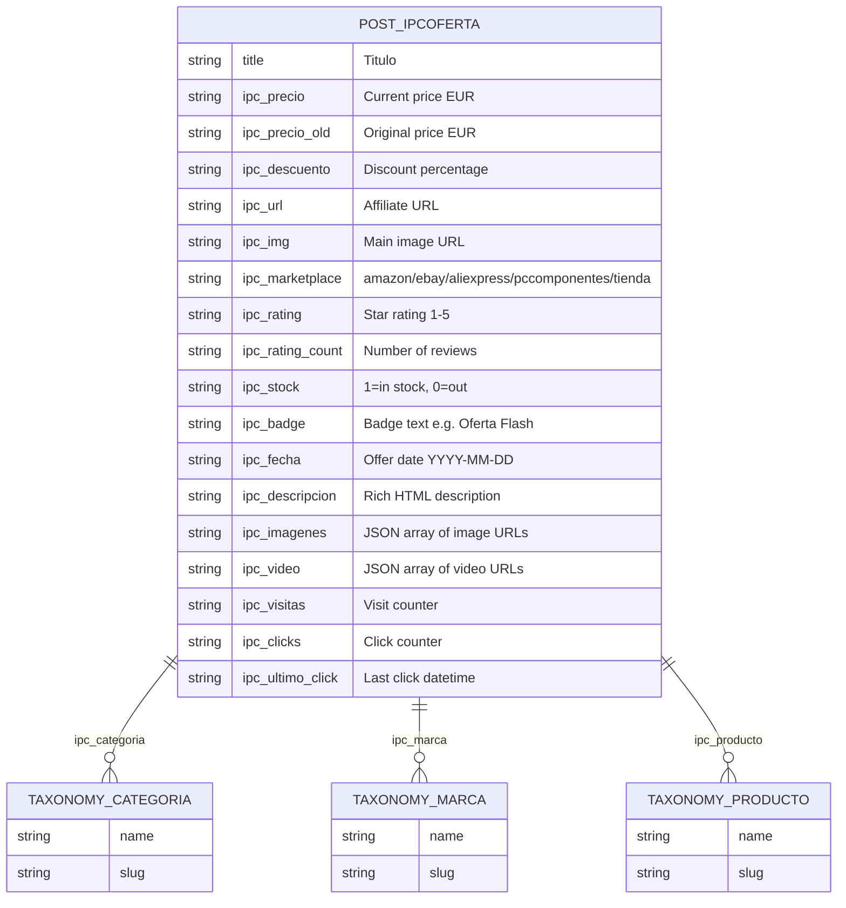

# Architecture

## File Structure

```
ikerbit-product-cards/
├── ikerbit-product-cards.php   ← Plugin entry point (main logic)
├── ipc-edit.php                ← Admin edit page for offers
├── ipc-styles.css              ← Shared CSS (cards, grids, layouts)
├── vendor/
│   └── yahnis-elsts/
│       └── plugin-update-checker/  ← Update checker library (v5.7)
├── templates/
│   ├── single-ipc_oferta.php       ← Single offer page
│   ├── taxonomy-ipc_categoria.php  ← Category listing
│   └── archive-ipc_oferta.php      ← General offers archive (/ofertas/)
├── AGENTS.md                   ← AI agent instructions
├── README.md                   ← Plugin description
├── CHANGELOG.md                ← Version history
└── docs/
    ├── ARCHITECTURE.md         ← This file
    ├── DEVELOPMENT.md          ← Development workflow
    ├── DECISIONS.md            ← Architecture decisions
    ├── ROADMAP.md              ← Planned features
    └── BACKLOG.md              ← Technical debt
```

## Plugin Initialization Flow

```mermaid
flowchart TD
    A[WordPress loads ikerbit-product-cards.php] --> B[ABSPATH guard]
    B --> B2[Include Plugin Update Checker]
    B2 --> B3[PucFactory: connect to GitHub updates]
    B3 --> C["Hook: init (priority default)"]
    C --> C1[register_post_type: ipc_oferta]
    C --> C2[register_taxonomy: ipc_categoria]
    C --> C3[register_taxonomy: ipc_marca]
    C --> C4[register_taxonomy: ipc_producto]
    B --> D["Hook: rest_api_init"]
    D --> D1[register_post_meta x16 fields]
    D --> D2[register_rest_route: POST /ipc/v1/oferta]
    D --> D3[register_rest_route: POST /ipc/v1/oferta/{id}]
    D --> D4[register_rest_route: DELETE /ipc/v1/oferta/{id}]
    D --> D5[register_rest_route: POST /ipc/v1/visita/{id}]
    D --> D6[register_rest_route: POST /ipc/v1/click/{id}]
    B --> E["Hook: wp_enqueue_scripts"]
    E --> E1[wp_enqueue_style: ipc-styles.css]
    E --> E2[wp_enqueue_style: Google Fonts]
    B --> F["Hook: admin_menu"]
    F --> F1[add_menu_page: ipc-settings]
    F --> F2[add_submenu_page: ipc-ofertas]
    F --> F3[add_submenu_page: ipc-stats]
    F --> F4[add_submenu_page: ipc-edit hidden]
    B --> G["Hook: template_include x2"]
    G --> G1[single-ipc_oferta.php]
    G --> G2[taxonomy-ipc_categoria.php]
    G --> G3[archive-ipc_oferta.php]
    G --> G4[Front page override priority 99]
    B --> H["Hook: wp_footer"]
    H --> H1[JS tracking visits + clicks + GA4]
```

## Data Model



All meta fields are stored as WordPress post meta (type: string). Numeric fields (`precio`, `descuento`, `rating`, `rating_count`, `visitas`, `clicks`) are cast at runtime.

## File Responsibilities

### `ikerbit-product-cards.php`

**Sections** (numbered with emoji dividers):

| # | Section | Lines | Description |
|---|---------|-------|-------------|
| 1 | Custom Post Type | 14–69 | Registers CPT `ipc_oferta` and 3 taxonomies |
| 2 | Meta Fields | 74–84 | Registers 16 meta fields in REST API |
| 3 | REST Endpoints | 88–115 | 5 REST routes: create, update, delete, visit, click |
| 4b | Counters | 117–135 | Visit/click registration functions |
| — | Auth & Meta helpers | 137–211 | `ipc_check_secret`, `ipc_guardar_meta`, CRUD handlers |
| 4 | Shortcodes | 216–428 | `[oferta]` and `[ofertas]` rendering |
| 5 | Styles | 433–450 | CSS and font enqueueing |
| 6 | Settings page | 455–615 | Admin config (secret, GA4, home page toggle) |
| 7 | Offers list | 620–762 | Admin table with sorting and deletion |
| 8 | Statistics | 767–940 | Dashboard with KPIs, top 10, CTR breakdowns |
| 9 | JS Tracking | 945–993 | Frontend visit/click tracking + GA4 events |

### `ipc-edit.php`

Admin subpage for editing individual offers. Registered as hidden from the menu (null parent).

Key functions:

| Function | Purpose |
|----------|---------|
| `ipc_edit_page()` | Renders the edit form with all meta fields |
| `ipc_edit_save()` | Handles form submission (nonce-protected) |
| `ipc_field()` | Helper to output labeled input fields |

Supports editing all meta fields including texto fields, images (textarea with preview), videos (textarea), and taxonomy terms (category, brand, product).

### `ipc-styles.css`

Shared CSS for:
- Product cards (`.ipc-card`) — responsive, hover effects
- Grid layout (`.ipc-wrap--grid`) — CSS Grid auto-fill
- Horizontal layout (`.ipc-wrap--horizontal`) — flexbox with overflow scroll
- Single/featured layout (`.ipc-wrap--single`, `.ipc-card--large`)
- Marketplace-specific button colors (`.ipc-btn--amazon`, etc.)
- Font family: DM Sans (body) + Syne (headings/badges)

### Templates

| Template | WordPress Context | Key Features |
|----------|-------------------|--------------|
| `single-ipc_oferta.php` | Singular offer page | Schema.org Product, image gallery, video player, breadcrumb, related offers |
| `taxonomy-ipc_categoria.php` | Category archive | Sort filters (date/descuento/precio), pagination, breadcrumb |
| `archive-ipc_oferta.php` | `/ofertas/` archive | Category pills, sort filters, only shows discounted offers by default |

## REST API

### Endpoints

```
POST   /wp-json/ipc/v1/oferta          Create offer (auth: X-IPC-Secret)
POST   /wp-json/ipc/v1/oferta/{id}     Update offer (auth: X-IPC-Secret)
DELETE /wp-json/ipc/v1/oferta/{id}     Delete offer (auth: X-IPC-Secret)
POST   /wp-json/ipc/v1/visita/{id}     Register visit (public)
POST   /wp-json/ipc/v1/click/{id}      Register click (public)
```

### Authentication

The create/update/delete endpoints require header `X-IPC-Secret` matching the value stored in `ipc_secret` option. The default value is `CAMBIA_ESTE_SECRET`.

Visit and click endpoints are public — they increment counters and return success.

### Request Body (Create/Update)

```json
{
  "titulo": "Product Title",
  "precio": "89.99",
  "precio_old": "119.99",
  "descuento": "25",
  "url": "https://www.amazon.es/dp/XXXXXXXXX?tag=tu-tag",
  "img": "https://image-url.jpg",
  "marketplace": "amazon",
  "rating": "4.5",
  "rating_count": "1243",
  "stock": "1",
  "badge": "Oferta Flash",
  "categoria": "ram",
  "fecha": "2026-03-28",
  "descripcion": "SEO description",
  "imagenes": ["url1.jpg", "url2.jpg"],
  "video": ["https://www.youtube.com/watch?v=XXXXX"],
  "marca": "Samsung",
  "producto": "Samsung Galaxy S24"
}
```

## Shortcodes

### `[oferta id="123"]`

Renders a single offer card (large size) by post ID.

### `[ofertas ...]`

Renders a grid or horizontal list of offers.

| Attribute | Default | Description |
|-----------|---------|-------------|
| `categoria` | — | Filter by category slug |
| `marketplace` | — | Filter by marketplace |
| `marca` | — | Filter by brand slug (supports `*` wildcard) |
| `producto` | — | Filter by product slug (supports `*` wildcard) |
| `limite` | 6 | Max number of offers |
| `layout` | grid | `grid` or `horizontal` |
| `orderby` | date | `date`, `descuento`, `clicks`, `visitas` |
| `order` | DESC | `ASC` or `DESC` |
| `condescuento` | — | `si` to show only discounted offers |

## Admin Pages

| Page | Capability | Description |
|------|-----------|-------------|
| Product Cards → Ajustes | `manage_options` | Secret key, GA4 config, home page toggle, shortcode reference, API docs |
| Product Cards → Todas las Ofertas | `manage_options` | Sortable table with all offers, delete action |
| Product Cards → Estadísticas | `manage_options` | KPI dashboard, top 10 by clicks, CTR by category/marketplace |
| Hidden → Editar Oferta | `manage_options` | Edit form for individual offer |

## Data Flow

```mermaid
flowchart LR
    subgraph "External (n8n)"
        A[n8n workflow]
    end
    subgraph "WordPress REST API"
        B[POST /ipc/v1/oferta]
        C[POST /ipc/v1/visita]
        D[POST /ipc/v1/click]
    end
    subgraph "Plugin"
        E[ipc_crear_oferta]
        F[ipc_guardar_meta]
        G[wp_insert_post]
        H[update_post_meta]
        I[wp_set_post_terms]
    end
    subgraph "Database"
        J[(wp_posts)]
        K[(wp_postmeta)]
        L[(wp_terms)]
    end
    subgraph "Frontend"
        M["[oferta] / [ofertas]"]
        N[ipc_render_card]
        O[HTML + CSS]
    end
    A -->|JSON + X-IPC-Secret header| B
    B --> E --> G --> J
    E --> F --> H --> K
    F --> I --> L
    Frontend visit --> C
    Frontend click --> D
    M -->|WP_Query| J
    M -->|get_post_meta| K
    M --> N --> O
```

## Dependencies

- **WordPress core** — minimum version: TODO (not specified)
- **Plugin Update Checker** (YahnisElsts v5.7) — enables automatic updates from GitHub releases. Bundled in `vendor/`.
- **hls.js** — CDN-loaded in single template for HLS video playback (`hls.js@1.4.12`)
- **Google Fonts** — DM Sans + Syne (loaded via `wp_enqueue_style`)
- **No PHP dependencies** — no Composer packages required at runtime
- **No JS build step** — no npm/webpack

## Hook Summary

| Hook | Priority | Purpose |
|------|----------|---------|
| `init` | default | Register CPT and taxonomies |
| `rest_api_init` | default | Register meta fields + REST routes |
| `wp_enqueue_scripts` | default | Enqueue CSS and fonts |
| `admin_menu` | default | Register admin pages (x2: main + ipc-edit) |
| `template_include` | default | Override templates for CPT singular, taxonomy, archive |
| `template_include` | 99 | Override front page with offer archive (when enabled) |
| `wp_footer` | default | Inject JS tracking code on offer pages |
